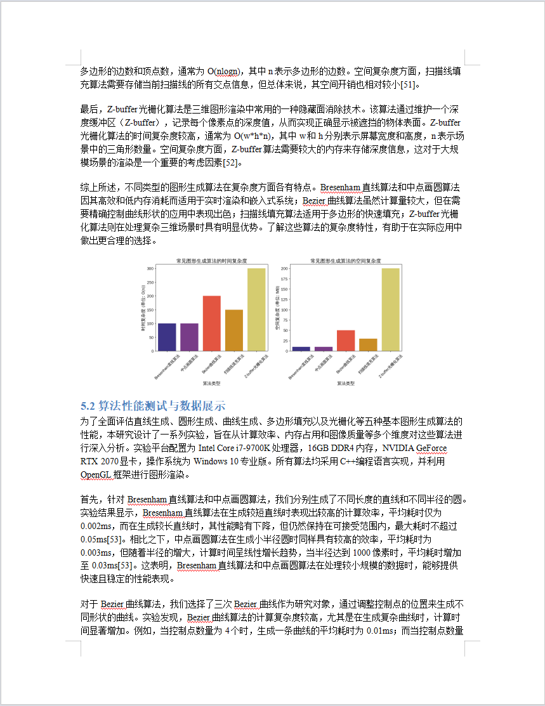

<<<<<<< HEAD
# 内容重写工具 (Content Rewriter)

一个基于AI技术的文档内容重写工具，可以自动提取、分析和重写Word文档内容，保留原始格式和图片。本工具支持通义和智谱API集成，提供图形用户界面，方便用户操作。

## 功能特点

- **多格式支持**：目前支持Word文档(.docx)格式
- **智能内容提取**：自动识别文档结构、段落和图片
- **数学公式支持**：自动识别和保留Office数学公式和LaTeX公式
- **AI驱动重写**：利用通义或智谱API重写文本内容
- **格式保留**：重写后保留原文档的格式和图片
- **导出多种格式**：支持导出为Word文档和Markdown格式
- **用户友好界面**：提供直观的图形用户界面
- **实时进度显示**：精确显示处理进度百分比和状态
- **高效并行处理**：智能多线程处理优化处理速度
- **缓存系统**：使用缓存提高处理速度并减少API调用

## 功能展示

### GUI界面


### 效果展示

| col1                                           | col2                                           |  |
| ---------------------------------------------- | ---------------------------------------------- | - |
|  |  |  |
|  |  |  |
|  |  |  |
|  |  |  |
|                                                |                                                |  |

## 安装说明

### 系统要求

- Python 3.7 或更高版本
- Windows/macOS/Linux 系统

### 安装步骤

1. 克隆或下载此仓库到本地:

   ```
   git clone https://github.com/yourusername/content-rewriter.git
   cd content-rewriter
   ```
2. 安装所需依赖:

   ```
   pip install -r requirements.txt
   ```
3. 配置API密钥:

   - 复制 `.env.example` 文件并重命名为 `.env`
   - 编辑 `.env` 文件，添加您的API密钥（您至少需要设置一个API密钥）:
     ```
     ZHIPU_API_KEY=your_zhipu_api_key_here
     TONGYI_API_KEY=your_tongyi_api_key_here
     ```
   - 您可以在以下网站获取API密钥:
     - 智谱AI: https://open.bigmodel.cn/
     - 通义千问: https://dashscope.aliyun.com/

### API密钥说明

本工具支持两种大语言模型API:

- **智谱AI (GLM-4)**：支持高质量的中文内容重写，推荐使用
- **通义千问 (Qwen)**：阿里云提供的大语言模型，内容重写质量良好

您只需要配置其中一种API密钥即可使用对应的服务。在图形界面中，您也可以选择使用哪种API。

## 快速开始

### 1. 准备环境
```bash
# 克隆项目
git clone https://github.com/yourusername/content-rewriter.git
cd content-rewriter

# 安装依赖
pip install -r requirements.txt
```

### 2. 配置API密钥
1. 复制环境变量模板：
   ```bash
   cp .env.example .env
   ```
2. 编辑 `.env` 文件，填入您的API密钥（选择其中一个即可）：
   ```
   ZHIPU_API_KEY=your_zhipu_api_key_here
   # 或
   TONGYI_API_KEY=your_tongyi_api_key_here
   ```

### 3. 准备文档
1. 在项目根目录创建 `input` 文件夹（如果不存在）
2. 将要处理的Word文档放入 `input` 文件夹

### 4. 运行程序
- **图形界面模式**（推荐）：
  - Windows：双击 `start_gui.bat`
  - 其他系统：运行 `python start_gui.py`
- **命令行模式**：
  ```bash
  python main.py
  ```

### 5. 查看结果
- 处理完成后，在 `output` 目录下可以找到：
  - `docx_files/`：重写后的Word文档
  - `markdown_files/`：重写后的Markdown文件
  - `images/`：文档中的图片

## 使用方法

### 图形界面模式

1. 运行启动脚本:

   - Windows: 双击 `start_gui.bat` 或运行 `python start_gui.py`
   - macOS/Linux: 在终端运行 `python start_gui.py`
2. 使用步骤:

   - 点击"浏览"按钮选择要处理的Word文档
   - 选择API类型（通义或智谱）
   - 输入相应的API密钥（如果尚未在.env文件中设置）
   - 点击"开始处理"按钮
   - 实时查看处理进度和日志信息
   - 处理完成后，点击"打开输出文件夹"查看生成的文件

### 命令行模式

也可以通过命令行直接运行:

```
python main.py
```

## 输出文件

处理完成后，您可以在 `output`目录下找到以下文件:

- `docx_files/`: 重写后的Word文档
- `markdown_files/`: 重写后的Markdown文件和相关图片
- `cache/`: 缓存文件目录，用于提高处理速度

## 最新更新

- **性能优化**:

  - 添加智能缓存系统，重复内容无需重复调用API
  - 动态线程池大小，根据系统资源自动调整
  - 分批处理大型文档，有效降低内存占用
  - 并行图片处理优化
- **公式处理**:

  - 智能识别Office数学公式和LaTeX公式
  - 数学公式保留原格式，不进行AI重写
  - 支持常见公式符号和结构的正确显示
- **进度显示优化**:

  - 添加精确的进度条和百分比显示
  - 详细的处理状态信息展示
- **稳定性提升**:

  - 改进错误处理机制
  - 完善日志系统
  - 增强大文件处理稳定性

## 处理性能

基于测试，与之前版本相比：

- 重复内容处理速度提升约80-90%（缓存系统）
- 整体处理速度提升约30-50%（多项优化）
- 内存占用减少约40%（分批处理）

## 注意事项

- 大型文档处理可能需要较长时间
- 图片识别和处理可能会消耗大量内存
- 请确保拥有足够的API调用额度
- 首次处理某类文档可能较慢，后续处理会因缓存而加速

## 常见问题

**Q: 为什么文档处理失败？**
A: 可能原因包括API密钥无效、网络连接问题、文档格式不兼容等。请查看日志获取详细错误信息。

**Q: 如何提高处理速度？**
A: 系统已经自动优化处理速度。如果需要进一步提升，可以考虑增加更多内存、使用更快的网络连接或升级CPU。

**Q: 如何处理包含复杂公式的文档？**
A: 系统会自动识别和保留数学公式。对于非常复杂或特殊的公式，可能需要手动检查处理结果。

**Q: 缓存文件占用空间太大怎么办？**
A: 您可以安全地删除 `output/cache`目录中的文件。这只会影响处理速度，不会影响功能。

## 贡献与反馈

欢迎提交问题报告、功能建议或代码贡献。您可以:

- 提交GitHub Issues
- 发起Pull Requests
- 通过电子邮件联系作者

## 许可证

本项目采用 MIT 许可证 - 详情见 [LICENSE](LICENSE) 文件
=======
# AI_rewriter
>>>>>>> 64429118084e808601e63ba941263961c28e3c62
