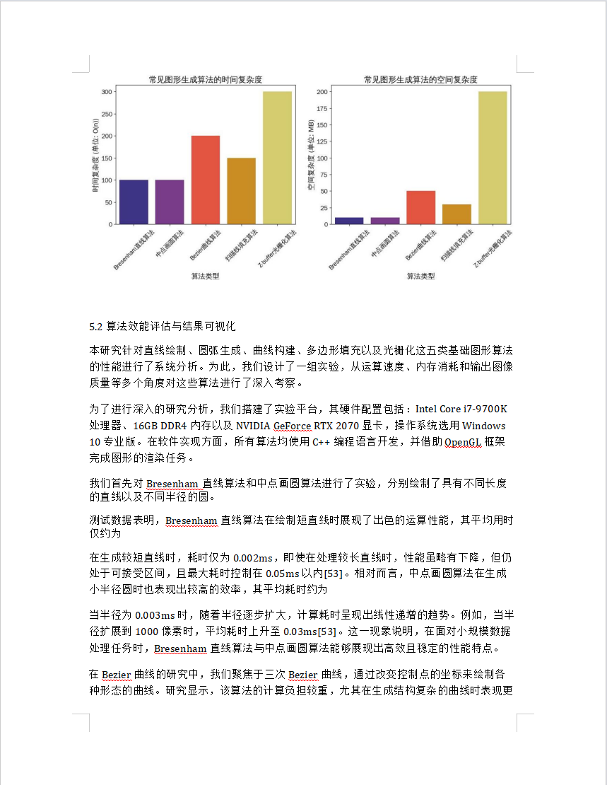
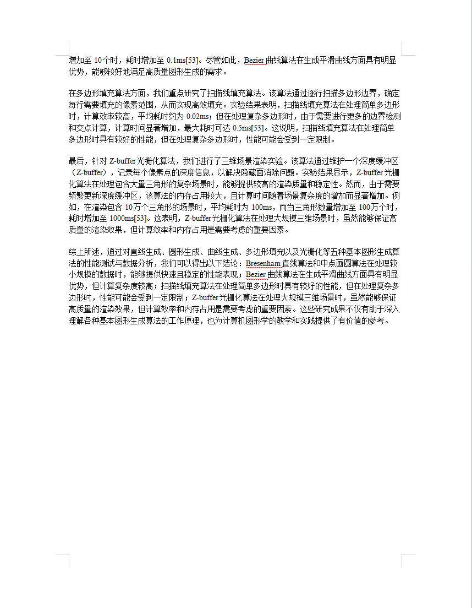
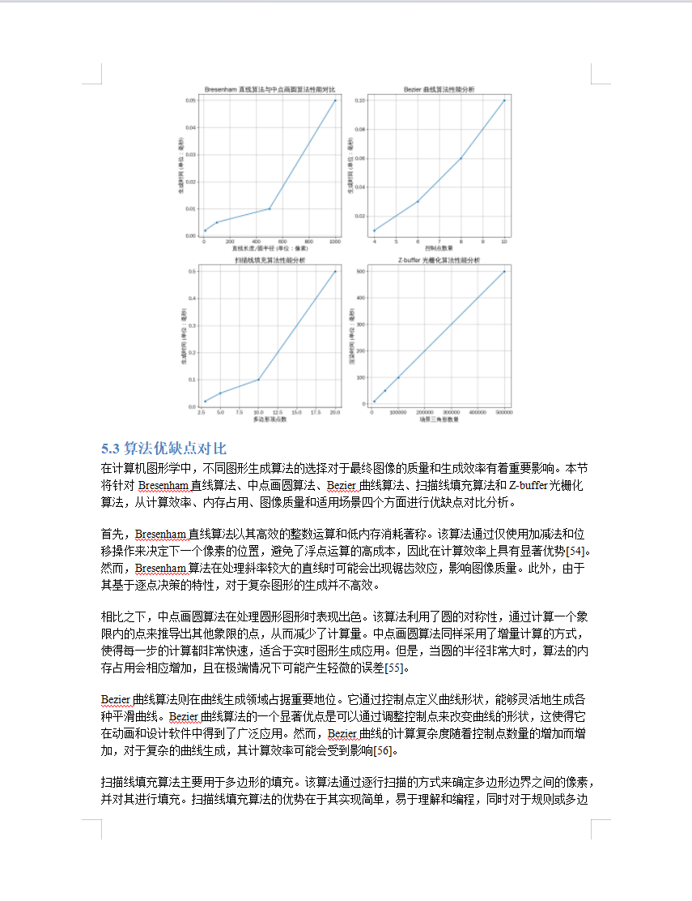
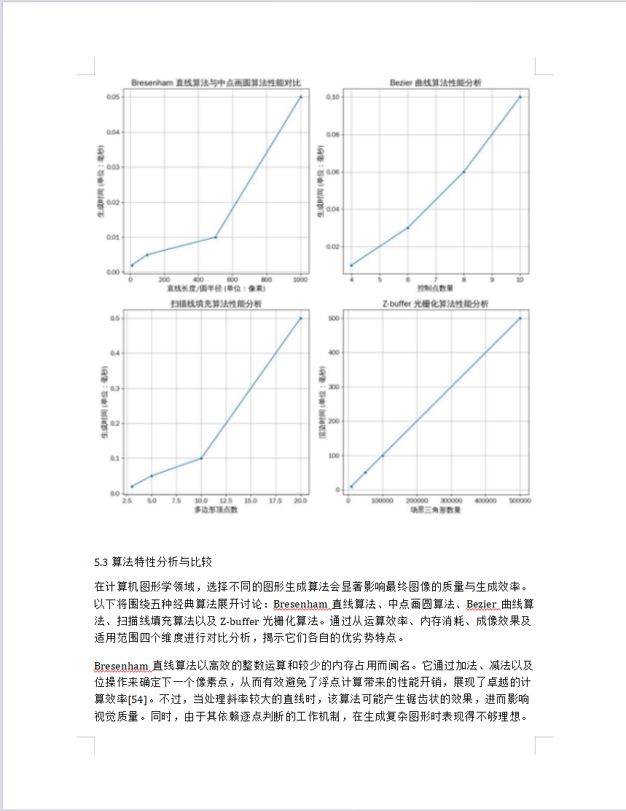

# Content Rewriter

An AI-powered document content rewriting tool that automatically extracts, analyzes, and rewrites Word document content while preserving original formatting and images. This tool supports integration with Tongyi and Zhipu APIs and provides a graphical user interface for easy operation.

## Features

- **Multiple Format Support**: Currently supports Word documents (.docx)
- **Intelligent Content Extraction**: Automatically recognizes document structure, paragraphs, and images
- **Mathematical Formula Support**: Automatically identifies and preserves Office math formulas and LaTeX formulas
- **AI-Driven Rewriting**: Uses Tongyi or Zhipu API to rewrite text content
- **Format Preservation**: Maintains the original document's formatting and images after rewriting
- **Multiple Export Formats**: Supports export to Word documents and Markdown format
- **User-Friendly Interface**: Provides an intuitive graphical user interface
- **Real-Time Progress Display**: Shows precise processing progress percentage and status
- **Efficient Parallel Processing**: Intelligent multi-threading optimizes processing speed
- **Caching System**: Uses caching to improve processing speed and reduce API calls

## Showcase

### GUI Interface


### Results Showcase

| before                                         | after                                          |  |
| ---------------------------------------------- | ---------------------------------------------- | - |
|  |  |  |
|  |  |  |
|  |  |  |
|  |  |  |
|                                                |                                                |  |

## Installation Guide

### System Requirements

- Python 3.7 or higher
- Windows/macOS/Linux systems

### Installation Steps

1. Clone or download this repository to your local machine:

   ```
   git clone https://github.com/yourusername/content-rewriter.git
   cd content-rewriter
   ```
2. Install required dependencies:

   ```
   pip install -r requirements.txt
   ```
3. Configure API keys:

   - Copy the `.env.example` file and rename it to `.env`
   - Edit the `.env` file and add your API keys (you need to set at least one API key):
     ```
     ZHIPU_API_KEY=your_zhipu_api_key_here
     TONGYI_API_KEY=your_tongyi_api_key_here
     ```
   - You can obtain API keys from the following websites:
     - Zhipu AI: https://open.bigmodel.cn/
     - Tongyi Qianwen: https://dashscope.aliyun.com/

### API Key Information

This tool supports two large language model APIs:

- **Zhipu AI (GLM-4)**: Supports high-quality Chinese content rewriting, recommended
- **Tongyi Qianwen (Qwen)**: A large language model provided by Alibaba Cloud, with good content rewriting quality

You only need to configure one of these API keys to use the corresponding service. In the graphical interface, you can also choose which API to use.

## Quick Start

### 1. Prepare Environment

```bash
# Clone the project
git clone https://github.com/yourusername/content-rewriter.git
cd content-rewriter

# Install dependencies
pip install -r requirements.txt
```

### 2. Configure API Key

1. Copy the environment variable template:
   ```bash
   cp .env.example .env
   ```
2. Edit the `.env` file and enter your API key (choose one):
   ```
   ZHIPU_API_KEY=your_zhipu_api_key_here
   # or
   TONGYI_API_KEY=your_tongyi_api_key_here
   ```

### 3. Prepare Documents

1. Create an `input` folder in the project root directory (if it doesn't exist)
2. Place the Word document to be processed in the `input` folder

### 4. Run the Program

- **Graphical Interface Mode** (recommended):
  - Windows: Double-click `start_gui.bat`
  - Other systems: Run `python start_gui.py`
- **Command Line Mode**:
  ```bash
  python main.py
  ```

### 5. View Results

- After processing is complete, you can find the following in the `output` directory:
  - `docx_files/`: Rewritten Word documents
  - `markdown_files/`: Rewritten Markdown files
  - `images/`: Images from the document

## Usage Instructions

### Graphical Interface Mode

1. Run the startup script:

   - Windows: Double-click `start_gui.bat` or run `python start_gui.py`
   - macOS/Linux: Run `python start_gui.py` in the terminal
2. Usage steps:

   - Click the "Browse" button to select a Word document to process
   - Select API type (Tongyi or Zhipu)
   - Enter the appropriate API key (if not already set in the .env file)
   - Click the "Start Processing" button
   - View real-time progress and log information
   - After processing is complete, click "Open Output Folder" to view the generated files

### Command Line Mode

You can also run directly from the command line:

```
python main.py
```

## Output Files

After processing, you can find the following files in the `output` directory:

- `docx_files/`: Rewritten Word documents
- `markdown_files/`: Rewritten Markdown files and related images
- `cache/`: Cache file directory for improving processing speed

## Latest Updates

- **Performance Optimization**:

  - Added intelligent caching system, no need to repeatedly call API for duplicate content
  - Dynamic thread pool size, automatically adjusts according to system resources
  - Batch processing of large documents effectively reduces memory usage
  - Parallel image processing optimization
- **Formula Processing**:

  - Intelligent recognition of Office math formulas and LaTeX formulas
  - Math formulas retain original format, no AI rewriting
  - Support for correct display of common formula symbols and structures
- **Progress Display Optimization**:

  - Added precise progress bar and percentage display
  - Detailed processing status information display
- **Stability Improvements**:

  - Improved error handling mechanism
  - Enhanced logging system
  - Improved stability for large file processing

## Processing Performance

Based on testing, compared to previous versions:

- Processing speed for duplicate content improved by about 80-90% (caching system)
- Overall processing speed improved by about 30-50% (multiple optimizations)
- Memory usage reduced by about 40% (batch processing)

## Notes

- Large document processing may take longer
- Image recognition and processing may consume a lot of memory
- Make sure you have enough API call quota
- First-time processing of a certain type of document may be slower, subsequent processing will be faster due to caching

## FAQ

**Q: Why did document processing fail?**
A: Possible reasons include invalid API key, network connection issues, incompatible document format, etc. Please check the log for detailed error information.

**Q: How to improve processing speed?**
A: The system already automatically optimizes processing speed. For further improvement, consider adding more memory, using a faster network connection, or upgrading your CPU.

**Q: How to handle documents with complex formulas?**
A: The system will automatically identify and preserve mathematical formulas. For very complex or special formulas, you may need to manually check the processing results.

**Q: What if cache files take up too much space?**
A: You can safely delete files in the `output/cache` directory. This will only affect processing speed, not functionality.

## Contributions and Feedback

Bug reports, feature suggestions, or code contributions are welcome. You can:

- Submit GitHub Issues
- Initiate Pull Requests
- Contact the author via email

## License

This project is licensed under the MIT License - see the [LICENSE](LICENSE) file for details
